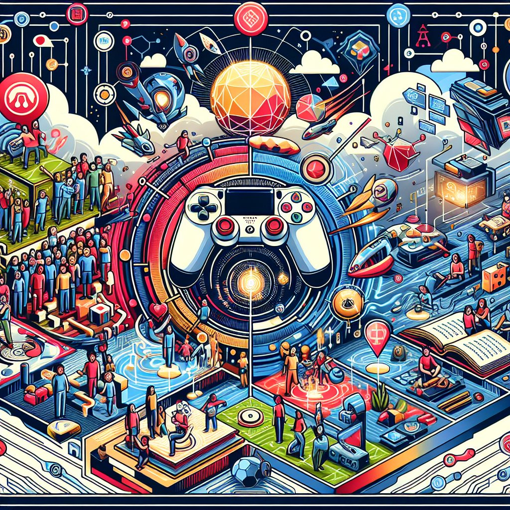

# 游戏内容

摘要：
**1、游戏内容的发展与创新显著影响玩家体验；2、玩家互动性增强，社交元素成为关键；3、市场趋势表明内容多样化是未来方向。** 在游戏行业中，内容不仅是吸引玩家的重要因素，更是决定游戏生命周期的关键。随着技术的进步，开发者不断探索新的叙事方式和玩法机制，以满足日益变化的玩家需求。

## 一、游戏内容的演变

自游戏产业诞生以来，内容就作为吸引玩家的核心要素。最初的游戏主要依赖简单的图形和线性的剧情，玩家的选择空间有限。然而，随着技术的不断发展，游戏内容逐渐向多元化和复杂化迈进。如今，开放世界游戏、非线性叙事和增强现实（AR）、虚拟现实（VR）等新兴技术的应用，使得游戏内容的表现手法丰富多彩。开发者不断挑战传统的游戏设计理念，创造出更加沉浸式和互动性的体验。

近几年，移动游戏的兴起进一步推动了游戏内容的演变。越来越多的开发者将目光投向移动端，利用短时间内的碎片化体验，将单一的游戏模式扩展为丰富多样的内容形式。例如，实时战略、卡牌对战、休闲益智等多种类型层出不穷，使得玩家可以在任何时间、任何地点享受游戏乐趣。

## 二、社交元素与玩家互动

现代游戏中，**社交互动已成为内容的重要组成部分**。许多游戏通过构建社区或社交平台，鼓励玩家之间的交流与合作。这类设计不仅增加了游戏的趣味性，还提升了玩家的归属感。例如，很多大型多人在线游戏（MMO）均设置了公会系统，玩家可通过组队和共同完成任务来增强彼此间的联系。此外，实时通讯技术的使用也让玩家能够更加便捷地进行社交互动，分享游戏心得、实时协同作战。

随着在线直播的流行，游戏内容的展示方式也发生了改变。越来越多的玩家通过直播分享自己的玩游戏经历，形成了一种新型的互动模式。**直播平台的兴起不仅为游戏内容提供了新的传播渠道**，还为开发者与玩家之间架起了沟通的桥梁。游戏公司可以通过观察直播中的反馈，及时调整游戏设计，以更好地迎合市场需求。

## 三、市场趋势与内容多样化

当前，游戏市场呈现出多样化发展的趋势，**内容的丰富性和灵活性正日益成为竞争的关键**。游戏开发者不仅需要关注游戏本身的质量，也需考虑如何让游戏内容保持新鲜感。定期更新和扩展游戏内容已成为一种必要策略，不仅能够延长玩家的留存周期，还能吸引新玩家加入。

此外，结合AI技术的游戏内容创新也正在崭露头角。通过利用人工智能分析玩家的行为数据，开发者能够更精准地了解玩家的需求，从而提供个性化的内容推荐。这种以玩家为中心的设计理念在未来将会更加强调，推动游戏品质的全面提升。

## 结语

随着游戏行业的不断发展，内容的重要性不可忽视。在未来，**保持内容的新鲜感和多样性将是吸引玩家和维护市场竞争力的核心要素**。无论是传统的单机游戏，还是新兴的在线社交游戏，内容的创新与发展将始终引领行业前行的方向。

