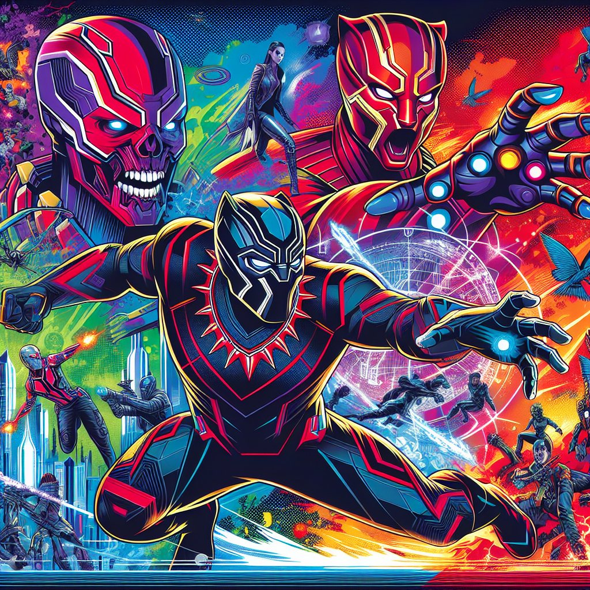

# 漫威终极逆转S3介绍

漫威终极逆转S3作为一款集成了多种元素的卡牌策略游戏，深受玩家们的喜爱。这一季推出了全新的角色与机制，使得游戏体验更加丰富。接下来，将从多个角度解析这一作品。

一、背景故事

在漫威宇宙中，英雄与反派之间的对抗从未停止。S3引入了更多来自不同宇宙的角色，给故事添上了新的篇章。玩家将面临更复杂的任务和挑战，每个角色都有独特的背景与技能设置，这使得每一次游戏体验都充满新意。游戏设定在一个混乱而又神秘的环境中，玩家需要利用自己的策略思考能力，挑战强敌，完成特定的使命。

**背景剧情**通过多层次的发展，增加了游戏的代入感，也为玩家提供了更多探索空间。随着剧情的推进，玩家将发现角色之间的联系与矛盾，使得整个故事更加引人入胜。

二、角色与技能

S3中新增了多种角色，不仅包括了传统的超级英雄，如钢铁侠和黑豹，还有一些较少出现的反派角色，例如神秘人和红骷髅。**每位角色都拥有各自独特的技能和战斗风格**，玩家需要根据自己的游戏策略选择合适的角色来参与对战。

例如，某些角色具备强大的单体攻击能力，而另一些则擅长群体控制或支援。他们的技能组合能够影响整个游戏的节奏，玩家必须合理安排手中的角色，以充分发挥其优势。

三、游戏机制

该游戏的核心机制围绕着卡牌策略展开，**玩家通过构建卡组与其他玩家进行对战**。卡牌的选择与组合是游戏胜负的关键，玩家需要不断优化自己的卡组，以应对不同对手的策略。

此外，S3还引入了一些特殊规则，如“回合制技能释放”和“组合攻击”，这使得对战过程更具深度与趣味性。**合理的卡牌使用与时机把握**，将直接影响到战斗的结果。因此，玩家不仅需要积累足够的经验，还需要在游戏中不断调整战术，以应对不同的局势。

四、社区互动

除了单人模式，S3也注重玩家间的互动。通过建立强大的社区，玩家可分享卡组构建技巧和游戏策略。**在线对战系统让玩家有机会与全球的对手一较高下**，提升了游戏的竞争性与乐趣。

社区活动、赛事等也为玩家带来了额外的动力，激励大家积极参与其中。在这样的环境中，玩家不仅可以提升游戏技艺，也能结交志同道合的朋友。

最后，值得注意的是，游戏内容的更新与扩展也在持续进行，这意味着玩家会不断获得新的角色与挑战，为漫威终极逆转S3增添了更多的乐趣与期待。

