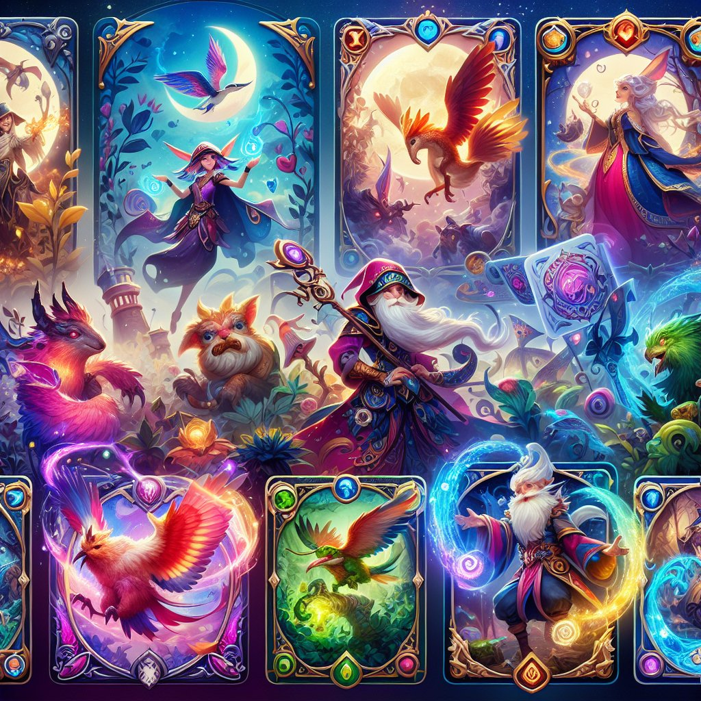

# 月圆之夜S5赛季更新

在新的月圆之夜S5赛季更新中，玩家们迎来了多项精彩的变化与内容，重磅推出的新卡牌和全新的游戏机制无疑提升了游戏的趣味性和策略深度。以下将详细解析此次更新的关键内容。

## 新卡牌介绍

1、**新英雄角色**  
本赛季增加了几位全新的英雄角色，每个角色都有独特的技能和特性。例如，新增的角色“暗影游侠”具备隐身能力，可以在敌人未发现之前进行偷袭。这不仅丰富了游戏的角色选择，也为战术布局提供了更多可能性。

2、**全新卡牌类别**  
此次更新引入了一种新的卡牌类型——“策略卡”，这类卡牌可以直接影响战斗方式及进程。策略卡的加入使得每场对局的变数增大，玩家必须灵活应对，制定更加多样化的战术。

## 游戏机制的改变

1、**调整战斗系统**  
开发团队对现有的战斗系统进行了优化，通过改进战斗节奏，使得游戏的流畅度显著提高。增加了连击系统，玩家可以根据卡牌的组合使用，产生不同的连击效果，从而打出更高的伤害。

2、**新手引导系统**  
为了帮助新玩家快速上手，更新中加入了更加完善的新手引导系统。通过简单易懂的教程和互动环节，新玩家可以迅速了解游戏基本操作和规则，降低了入门的门槛。

## 体验优化

1、**用户界面改良**  
游戏界面经过重新设计，采用了更加清晰和友好的布局，使得信息呈现更为直观。玩家在游戏过程中能够更加便利地获取所需信息，减少了操作的繁琐感。

2、**修复BUG与平衡性调整**  
开发团队针对之前赛季中出现的多个BUG进行了修复，并对部分卡牌进行了平衡性的调整，确保游戏的公平性与竞争性。这种持续的优化精神，将为玩家提供更加良好的游戏环境。

## 结论

月圆之夜S5赛季的更新无疑是一次全面的提升，不仅加入了新鲜的元素，更是在保持游戏核心玩法的基础上，增强了整体的趣味性与策略性。期待玩家们在新赛季中体验到这些变化带来的乐趣，同时也欢迎大家积极反馈，为我们创造更好的游戏环境。

